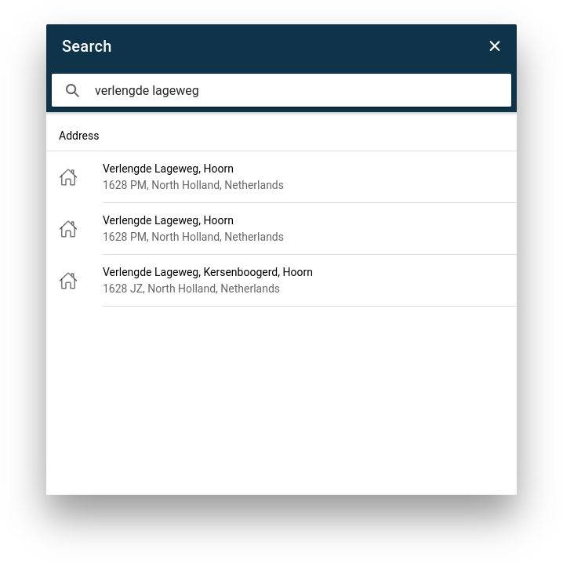

[filename](_header.md ':include')

# Algemeen

Cogo Collect is een app om uiteenlopende geo-data te registreren. Er kunnen punten, lijnen en vlakken worden
gedigitaliseerd, op basis van de gebruikers’ locatie (GPS) of handmatige invoer op een kaart. De geografische objecten
kunnen een beschrijving krijgen die op basis van een vooraf gemaakt template of vrije invoer. Daarnaast kan een bijlage
zoals foto worden toegevoegd.

# Inloggen

Muteren in Cogo Collect kan alleen wanneer je bent ingelogd. De inloggegevens bestaan uit een _Gebruikersnaam_ en een
_Wachtwoord_. De _Gebruikersnaam_ is jouw emailadres binnen de organisatie account. Het _Wachtwoord_ ontvang je per
email, nadat
de beheerder jouw account heeft aangemaakt.

> N.B.: Jouw credentials zijn strikt persoonlijk en alleen bij jou bekend

Bij de eerste stap maak je je bekend aan het systeem via je _Gebruikersnaam_.

Na 8 uur inactiviteit met de app logt deze automatisch uit als veiligheidsmaatregel. Je zult daarna dus opnieuw moeten
inloggen om gebruik te kunnen maken van de app.

## Azure AD

## Wachtwoord vergeten

Als je jouw wachtwoord bent vergeten, druk je op de knop _Forgot Password_ of _Wachtwoord vergeten_ onderaan het
inlogscherm.
Vul jouw emailadres in en klik op _Versturen_. Je ontvangt een email met een code om je wachtwoord te wijzigen.

Vul vervolgens de code die is verstuurd in en het nieuwe wachtwoord, ook een twee keer ter bevestiging.

> Let op: de code die wordt verstuurd is 5 minuten geldig. Vraag een nieuwe code aan als het invullen langer duurt dan 5
> minuten

# Topics

Een topic is een groep van kaartlagen die gebruikt worden voor het bijhouden van gegevens over een bepaald onderwerp.
Binnen een topic vervullen de kaartlagen meestal een eigen functie, zoals een hoofdobject en subobjecten. Bij de eerste
keer openen van een topic worden de gegevens van alle kaartlagen gedownload naar een lokale database.

# De kaart

De kaartweergave is de centrale plek van de applicatie.

## Verkennen

Verkennen op de kaart is een basishandeling om een locatie te vinden en om vervolgens informatie op te vragen of nieuwe
informatie toe te voegen. Dit kan op drie manieren:

### Op de kaart

Door de kaart te verschuiven en in- of uit te zoomen kunnen de gegeven worden verkend. Gebruik je muis pointer voor het
schuiven en het scroll wieltje voor het zoomen. Op je mobiele apparaat kun je gebaren gebruiken zoals swipen en zoomen
gebruiken om snel door de app te navigeren.

### GPS

Via de GPS functie kan de kaart worden getoond van je huidige locatie. Kies hiervoor de GPS knop om deze functie aan te
zetten. De applicatie zal de locatie vervolgens blijven volgen. De blauwe stip geeft de huidige locatie aan, de cirkel
de nauwkeurigheid van de plaatsbepaling. Het volgen blijft actief totdat de kaart wordt verschoven.

### Zoekfunctie

Via de zoekfunctie kan een locatie worden gezocht van een adres of van een object binnen de applicatie. Kies hiervoor de
zoek knop rechts bovenin. Er verschijnt vervolgens een zoekvenster.

Type de zoekterm, het venster zal direct gaan zoeken naar een corresponderend adres of een match in de data. De
resultaten worden in het zoekvenster getoond. Kies de regel uit de lijst, de applicatie zal de kaart tonen van deze
locatie.

## Informatie opvragen

Informatie uit een kaartlaag wordt getoond als een symbool: een gekleurd bolletje of een icoon op de kaart. Klik op tap
op een symbool om informatie op te vragen. De informatie van het symbool wordt vervolgens getoond in een formulier.

# Muteren

> Wijzigen van gegevens

## Een object wijzigen

Tap of klik op een symbool. Er verschijnt een formulier met informatie. Pas de gegevens aan en kies vervolgens
‘Opslaan’. Het symbool zal eerst even grijs oplichten. Wanneer de wijziging succesvol is kleurt het symbool op de kaart.
Het symbool is nu gewijzigd.

## Een object aanmaken

Navigeer naar de locatie van het nieuwe object. Nadat het object in beeld is druk je rechts onderin op de blauwe ‘plus’
knop. Er verschijnt een vizier op het scherm, beweeg met je vingers de kaart totdat de in het midden van het object
staat. Druk hierna op ‘Punt vastleggen’ en dan op ‘Gereed’.

Nadat de locatie is gekozen, kan het object van informatie worden voorzien. Vul de gegevens in het formulier aan de
rechterkant in. Verplichte velden hebben een ‘*’ achter de naam van het veld staan. Als alles is ingevuld kies dan op
‘Opslaan’. Het symbool zal eerst even grijs oplichten. Wanneer de wijziging succesvol is kleurt het symbool op de kaart.
Het symbool is nu gewijzigd.

## Een object verwijderen

Tap of klik op een symbool. Er verschijnt een formulier met informatie. Links onderin staat een rode prullenbak. Kies
deze optie en bevestig je keuze. Het object zal eerst even grijs oplichten. Wanneer de wijziging succesvol is verdwijnt
het object van de kaart. Het object is nu verwijderd.

## Geometrie wijzigen

Via de volgende stappen kan een locatie worden gewijzigd:

1. Selecteer het symbool; er klapt een keuzemenu uit
2. Klik op ‘Bewerk geometrie’
3. Zet het vizier op de juiste locatie
4. Klik op ‘Punt vastleggen’ en vervolgens ‘Gereed’
5. Bevestig via ‘Opslaan’
   Het symbool is nu verplaatst naar de gewenste positie.

## Sneltoetsen

Gebruikers met een toetsenbord kunnen gebruik maken van sneltoetsen. De volgende sneltoetsen zijn beschikbaar:

ROI gebruikers hebben nog twee extra opties om te kunnen kopiëren en plakken tussen bouwlagen. Zie voor meer informatie
de [documentatie voor ROI gebruikers](roi-users.md)