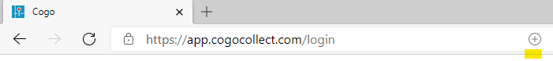

[filename](_header.md ':include')

# Installatie

De applicatie werkt op alle belangrijke desktop- en mobiele platforms en beschikbaar in de App Store voor iPad en iPhone, de Play Store voor
Android-apparaten en de Microsoft Store voor Windows-apparaten. Daarnaast is Cogo ook via de webbrowser te gebruiken als desktop-web-app.

### App Store

Open de app store en zoek op de term _Cogo Collect_ en kies installeer. Na installatie is de app is direct klaar om gebruikt te gaan
worden.
* [Apple App Store](https://apps.apple.com/nl/app/cogo-collect/id1043488559)
* [Google Play Store](https://play.google.com/store/apps/details?id=com.baasgeo.cogo)
* [Microsoft Store](https://apps.microsoft.com/store/detail/cogo-collect/9NFCVNQLGG5H)

### Browser (Desktop of laptop)

Op de desktop kan de app via de browser worden gebruikt. Navigeer hiervoor naar de website van Cogo en kies de bovenste
knop ‘Login’ of ga rechtstreeks naar de url van de webapp.

* Website: https://cogocollect.nl
* Webapp: https://app.cogocollect.com

### Als webapp

Gebruikers van Chrome of Edge kunnen Cogo installeren op de computer als een webapp. Ga naar de webapp url met de
browser.

Bij Chrome verschijnt er een rondje met een plusje in de adresbalk (zie geel gearceerd), dit is de optie om de
app te installeren.

Bij Edge is het een icoontje met een pijltje. Vervolgens komt de optie om de app te installeren in het start menu.
Kies de optie in de adres balk en bevestig, de app zal vervolgens offline beschikbaar zijn als een destop applicatie. Na
installatie is de app in het start menu offline beschikbaar als een desktop applicatie:
