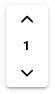

[filename](_header.md ':include')

# Repressieve Object Informatie (ROI)

> Registratie van planvorming gebeurt volgens het Informatiemodel Repressieve Object Informatie (ImROI). Cogo volgt zo
> veel mogelijk de structuur van dit model. De registratie van planvorming begint altijd met een repressief object.
>
> Vanuit een repressief object wordt de planvorming verder opgebouwd naar bijvoorbeeld sub-objecten zoals bijvoorbeeld
> opstelplaatsen, bouwlagen en verdere dbk gegevens.

## Aanmaken repressief object

Navigeer naar de locatie van het object, zoek op een adres of gebruik je GPS. Zie voor een algemene beschrijving van de
navigeer mogelijkheden paragraaf 3.1.

Nadat het object in beeld is druk je rechts onderin op de blauwe ‘plus’ knop. Er verschijnt een vizier op het scherm.
Beweeg de kaart totdat het vizier in het midden van het object staat. Druk hierna op ‘Punt vastleggen’ en dan op
‘Gereed’. Het is ook mogelijk om sneltoetsen te gebruiken, zie paragraaf 4.5.

Nu de locatie is gekozen, kan het object van informatie worden voorzien. Er verschijnt een formulier met
objectinformatie. Vul de gegevens in het formulier vervolgens in. Verplichte velden hebben een ‘*’ achter de naam van
het veld staan. Wanneer alles is ingevuld, druk dan op ‘Opslaan’. Het object is aangemaakt er er verschijnt een blauwe
stip op de kaart.

> Wanneer een nieuwe objectlocatie binnen een pand valt, dan word er automatisch een pand aangemaakt. Dit is
> een geel vlak op de kaart.

### Actieve bouwlaag

De ROI module voor gebouwen bevat extra functionaliteit voor het wisselen tussen een bouwlaag. Via de omhoog en beneden
knop
kan tussen een bouwlaag worden gewisseld. Door op het getal te klikken kan in één stap naar een andere bouwlaag worden
gewisseld.

De kopieer en plak functie haakt hier op in door het mogelijk te maken om objecten te kunnen naar een andere bouwlaag.
Zie ook: [Kopiëren tussen bouwlagen](#kopiëren-tussen-bouwlagen).

## Bouwlagen

Nu het object is aangemaakt gaan we verder met bouwlagen. Het gele vlak binnen de contouren van het gebouw is een
bouwlaag. Op de bouwlaag kunnen symbolen en scheidingen worden toevoegen als vorm van informatievoorziening.
Als een object is aangemaakt binnen een pand, maakt Cogo automatisch de eerste bouwlaag aan. Er verschijnt een geel vlak
met een geel bolletje op de kaart. Aan het bolletje kan extra informatie worden gekoppeld. Dit staat beschreven in
paragraaf 5.4. .

Er kan ook handmatig een bouwlaag worden toegevoegd, dit staat beschreven in paragraaf 5.3.3. .

### Extra bouwlagen

Het kan zijn dat er een dreiging, installatie/veiligheidsvoorziening of gevaarlijke stof zich bevindt op een andere
bouwlaag. In dat geval kan er ook een bouwlaag aangemaakt worden op de etage waar deze zich bevinden.
Wisselen van bouwlaag kan via de ImROI toolbar. Klik rechts boven op ‘Bouwlaag 1’. Er verschijnt een menu waar een
andere bouwlaag gekozen kan worden. Kies hier bijvoorbeeld de tweede bouwlaag (eerste verdieping). Klik op “Bouwlaag 2”
aan en bevestig dit door op gereed te drukken. Je bent nu geschakeld naar de tweede bouwlaag.
Door op het repressief object (het blauwe bolletje) te klikken, activeer je een keuzemenu. Hier kun je diverse acties
uitvoeren, waaronder bouwlagen toevoegen. Druk op ‘Toevoegen bouwlaag’, zet het vizier in het midden van de bouwlaag en
kies ‘Punt vastleggen’ en dan ‘Gereed’. Druk daarna op opslaan om de nieuwe bouwlaag aan te maken. Er verschijnt
vervolgens geel vlak op de kaart.

### Meerdere gebouwen bij 1. object

Een repressief object kan meerdere gebouwen bevatten. Bij het aanmaken van het object wordt er altijd maar 1. gebouw
automatisch aangemaakt. Je kunt de extra gebouwen zelf toevoegen aan het object.
Via de volgende stappen kan je een tweede gebouw toevoegen:

* Selecteer het repressief object (het blauwe bolletje)
* Klik op ‘Toevoegen bouwlaag’
* Zet het vizier in het midden van het tweede gebouw
* Klik op ‘Punt vastleggen’ en vervolgens ‘Gereed’ (of gebruik de sneltoetsen, zie 4.5. )
* Bevestig via ‘Opslaan’

Er verschijnt een geel vlak op de kaart. Dit betekent dat het gelukt is om de bouwlaag in het gebouw toe te voegen en te
koppelen aan het repressieve object. Ook aan het tweede gebouw kunnen nu symbolen worden toegevoegd en meerdere
bouwlagen worden aangemaakt. Dit staat beschreven in paragraaf 5.4. .

### Bouwlaag handmatig tekenen

De bouwlagen worden automatisch opgehaald uit de Basisregistratie Adressen en Gebouwen (BAG). Het is mogelijk om
handmatig een bouwlaag te tekenen. Dit kan bijvoorbeeld gebruikt worden voor parkeergarages met een andere contour dan
het gebouw.

Kies ‘Toevoegen handmatige bouwlaag’, zet het vizier op het punt waar je wilt beginnen en druk vervolgens op ‘Tussenpunt
toevoegen’. Swipe vervolgens naar het volgende hoekpunt, kies weer ‘Tussenpunt toevoegen’ en ga zo door tot de contour
gereed is. Kies vervolgens ‘Gereed’ en daarna ‘Opslaan’. Er verschijnt een geel vlak op de kaart met een blauwe rand.

## Symbolen en scheidingen

In deze paragraaf staat uitgelegd hoe je symbolen toevoegt aan een bouwlaag. De symbolen zijn onder te verdelen in
verschillende onderdelen:

* Dreiging
* Gevaarlijke stof
* Ingang
* Installatie of veiligheidsvoorziening
* Tekstlabel
* Scheiding

Deze onderdelen horen altijd bij een bouwlaag. Het toevoegen van een symbool of scheiding begint altijd bij de bouwlaag,
het gele bolletje op de kaart.

### Risico

De dreigingen bestaan uit een aantal dreigingen. Deze soorten dreiging zijn bijgevoegd in bijlage 2.
Een dreiging toevoegen doe je als volgt:

1. Selecteer de juiste bouwlaag door op het gele bolletje te klikken
2. Een keuzemenu klapt uit, kies voor ‘Toevoegen dreiging’
3. Zet het vizier op de juiste locatie (of via coördinaten/GPS, zie 3.1)
4. Klik op ‘Punt vastleggen’ en vervolgens ‘Gereed’ (of gebruik de sneltoetsen, zie 4.5. )
5. Kies de soort dreiging (verplicht)
6. Bevestig via ‘OK’
7. Voer specifieke informatie in bij bijzonderheden
8. Voeg eventueel een foto toe
9. Bevestig via ‘Opslaan’

De dreiging is toegevoegd. Om jezelf te controleren kan je op het symbool van de dreiging klikken. Hiermee zie je of de
informatie die jij hebt ingevoerd juist is.

### Gevaarlijke stof

Gevaarlijke stoffen kunnen binnen in een pand zijn, maar ook buiten een pand zijn. Om een gevaarlijke stof toe te voegen
voor binnen en buiten volg je deze stappen:

1. Selecteer de juiste bouwlaag door op het gele bolletje te klikken
2. Een keuzemenu klapt uit, kies voor ‘Toevoegen gevaarlijke stof’
3. Zet het vizier op de juiste locatie (of via coördinaten/GPS, zie 3.1)
4. Klik op ‘Punt vastleggen’ en vervolgens ‘Gereed’ (of gebruik de sneltoetsen, zie 4.5. )
5. Vul het GEVI nummer en UN nummer in (verplicht)
6. Vul vervolgens eventuele bijzonderheden in, de hoeveelheid en kies de eenheid en toestand
7. Voeg eventueel een foto toe
8. Bevestig via ‘Opslaan’

Controleer jezelf door op het symbool te drukken. Hierdoor verschijnt de informatie en foto die jij
hebt toegevoegd

### Ingang

Onder het kopje ingang vallen diverse soorten ingangen. Zo staat er onder ingang o.a.: Brandweeringang, Neveningang,
Brandweerlift, etc.
Plaats een ingang via de volgende stappen:

1. Selecteer de juiste bouwlaag door op het gele bolletje te klikken
2. Een keuzemenu klapt uit, kies voor ‘Toevoegen ingang’
3. Zet het vizier op de juiste locatie (of via coördinaten/GPS, zie 3.1)
4. Klik op ‘Punt vastleggen’ en vervolgens ‘Gereed’ (of gebruik de sneltoetsen, zie 4.5. )
5. Selecteer het type ingang via het keuzemenu
6. Sommige bedrijven hebben nummers voor hun ingangen. Deze kunnen worden toegevoegd via nummeraanduiding, dit is geen
   verplicht veld
7. Voer eventuele bijzonderheden in
8. Voeg eventueel een foto toe
9. Bevestig via ‘Opslaan’

Het symbool is toegevoegd. Voer bij bijzonderheden geen sleutelbuis/kluis toe. De sleutelbuis/kluis heeft aan apart
symbool.

Let op: Bij het toevoegen van een ingang van buiten naar binnen moet deze buiten het gebouw geplaatst worden zodat de
pijl naar binnen wijst. Cogo zal automatisch de ingang roteren en tegen de gebouwcontour aanzetten.

### Installaties/veiligheidsvoorzieningen

Onder dit kopje vallen meerdere symbolen, zoals gasafsluiters, sprinklerafsluiters, cv afsluiters, brandmeldpaneel,
brandmeldcentrale, blussysteem stikstof, etc.

1. Selecteer de juiste bouwlaag door op het gele bolletje te klikken
2. Een keuzemenu klapt uit, kies voor “toevoegen installatie/veiligheidsvoorziening
3. Zet het vizier op de juiste locatie (of via coördinaten/GPS, zie 3.1)
4. Klik op ‘Punt vastleggen’ en vervolgens ‘Gereed’ (of gebruik de sneltoetsen, zie 4.5. )
5. Selecteer het soort voorziening, een keuzemenu klapt uit
6. Voer eventuele bijzonderheden in, allen specifieke informatie
7. Voeg eventueel een foto toe
8. Klik op “opslaan”

Voor het volledige overzicht van symbolen zie bijlage 1. symbolen index

### Scheidingen

Cogo biedt de mogelijkheid om scheidingen in te kunnen tekenen. Hiermee kunnen compartimenten worden aangegeven in het
repressieve object. Bij de scheidingen kan ook gebruik gemaakt worden van de WBDBO, de keuze bestaat uit 30 min, 60 min
en 120 min. Iedere kleur heeft zijn eigen categorie. Een scheiding kan worden toegevoegd via de volgende stappen:

1. Selecteer de juiste bouwlaag door op het gele bolletje te klikken
2. Een keuzemenu klapt uit, kies voor “toevoegen scheiding”
3. Zet het vizier op de juiste locatie (of via coördinaten/GPS, zie 3.1)
4. Klik op ‘Tussenpunt toevoegen’
5. Zet het vizier op de volgende locatie en klik op ‘Tussenpunt toevoegen’
6. Herhaal stap 6. tot en met het eindpunt en kies daarna ‘Gereed’
7. Kies de soort scheiding
8. Voeg eventueel een foto toe
9. Bevestig via ‘Opslaan’

### Tekstlabels

Er zijn verschillende soorten tekstlabels voor uiteenlopende doeleinden:

* Algemeen (voor bijvoorbeeld verschillende bouwdelen/vleugels)
* Gevaar
* Voorzichtig
* Waarschuwing
* Calamiteitendoorgang
* Publieke ingang

Door de volgende stappen te volgen voeg je een tekstlabel toe:

1. Selecteer de juiste bouwlaag door op het gele bolletje te klikken
2. Een keuzemenu klapt uit, kies voor “toevoegen tekstlabel”
3. Zet het vizier op de juiste locatie (of via coördinaten/GPS, zie 3.1)
4. Klik op ‘Punt vastleggen’ en vervolgens ‘Gereed’ (of gebruik de sneltoetsen, zie 4.5. )
5. Kies de categorie van het tekstlabel
6. Vul de omschrijving in
7. Bevestig via ‘Opslaan’

## Symbolen verplaatsen

Staat er een symbool niet op de juiste plaats? Dan kun je de volgende stappen volgen om het symbool
op je juiste plaats te krijgen:

1. Selecteer het symbool; er klapt een keuzemenu uit
2. Klik op ‘Bewerk geometrie’
3. Zet het vizier op de juiste locatie (of via coördinaten/GPS, zie 3.1)
4. Klik op ‘Punt vastleggen’ en vervolgens ‘Gereed’ (of gebruik de sneltoetsen, zie 4.5. )
5. Voeg eventuele bijzonderheden toe
6. Bevestig via ‘Opslaan’
   Het symbool is nu verplaatst naar de gewenste positie.

## Kopiëren tussen bouwlagen

De ROI module voor gebouwen bevat extra functionaliteit voor het wisselen tussen een bouwlaag. De kopieer en plak
functie haakt hier op in door het mogelijk te maken om objecten
te kunnen naar een andere bouwlaag. Denk hierbij bijvoorbeeld aan repeteerde bouwkundige scheidingen of voorzieningen
die op meerdere verdiepingen terugkomen. Hoe gaat dit in z’n werk? Klik een object aan op de kaart. Kies vervolgens de
rechter muis knop en de optie kopieer uit de lijst. Er verschijnt een toast dat het kopiëren is gelukt en het formulier
wordt gesloten. Wissel vervolgens van bouwlaag. Kies nu via de rechtermuis knop de optie plakken. Bevestig de geplaatste
voorziening met _Opslaan_.

## Verwijderen voorzieningen

Het kan natuurlijk zo zijn dat er iets verandert aan een object of dat het per ongeluk verkeerd is neergezet. Het gebouw
is gesloopt, er is geen plan meer nodig of er is iets gewijzigd aan het gebouw. Als dat zo is, kan het object worden
verwijderd. Selecteer de voorziening door op de kaart te klikken of tappen. Er verschijnt een formulier met links onderin een rode
prullenbak. Kies de prullenbak en bevestig je keuze.

### Verwijderen repressief object

Selecteer het repressief object (via het blauwe bolletje). Er verschijnt een formulier met links onderin een rode
prullenbak. Kies de prullenbak en bevestig je keuze, het gehele repressieve object zal worden verwijderd.

> Let op: bij het verwijderen van een repressief object gaat alle informatie die bij dit object hoort ook verloren. Dit
> zijn ook alle bijbehorende bouwlagen, scheidingen en symbolen!!

Een tussenstap is om het repressieve object een andere fase te geven. Pas de fase aan naar _Inactief_ en sla het object
op. Het repressieve object is dan **niet** meer zichtbaar in LiveOp of MOI en alleen nog zichtbaar in Cogo Collect,
zonder de voorzieningen.

### Verwijderen bouwlaag

Selecteer de juiste bouwlaag door op het gele bolletje te klikken. Er verschijnt een formulier met links onderin een
rode prullenbak. Kies de prullenbak en bevestig je keuze, de gehele bouwlaag zal worden verwijderd.
Let op: bij het verwijderen van een bouwlaag gaat alle extra informatie die bij de bouwlaag hoort ook verloren. Dit zijn
ook alle bijbehorende scheidingen en symbolen!!

### Verwijderen symbolen

Selecteer het symbool. Er verschijnt een formulier met links onderin een rode prullenbak. Kies de prullenbak en bevestig
je keuze, het symbool zal worden verwijderd.

# Technische documentatie

Technische documentatie over ROI - zoals het gebruikte datamodel, de symbolen en metadata - is terug te vinden in een
aparte reposity. De
informatie is software onafhankelijk en kan worden toegepast voor vrijwel alle typen GIS software.

Technische documentatie over ROI: [https://imroi.github.io/kaartsymbolen/](https://imroi.github.io/kaartsymbolen/)

## Kaartsymbolen

De symbologie en de code die wordt gebruikt in Cogo Collect voor ROI is terug te vinden in een symbolen repository met
een
kant-en-klaar overzicht. Gebruik deze codes om bijvoorbeeld voorzieningen toe te kunnen voegen aan de applicaties.

https://imroi.github.io/kaartsymbolen/

Het is ook mogelijk om terug te melden op bepaalde symbology. Maak een nieuwe issue aan wanneer symbology niet correct
is of de beschrijving niet klopt.

https://github.com/imroi/kaartsymbolen/issues

## Datamodel

Het gebruikte datamodel in Cogo Collect voor ROI is terug te vinden in een datamodel repository en geeft de gebruikte
tabellen, velden en onderlinge relaties op database niveau.

https://imroi.github.io/datamodel/

Het is ook mogelijk om terug te melden op het datamodel. Maak een nieuwe issue aan wanneer symbology niet correct
is of de beschrijving niet klopt.

https://github.com/imroi/datamodel/issues

